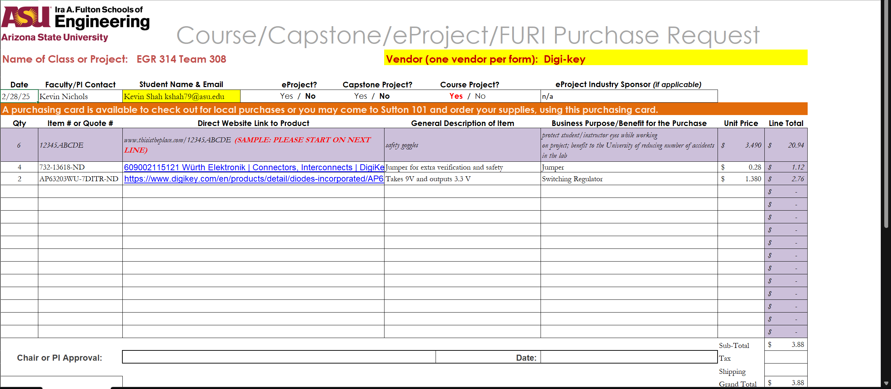
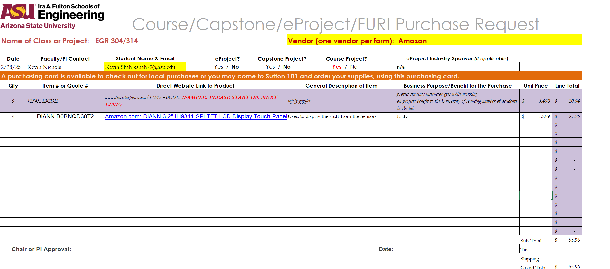

| Part Name/Description | Unit Quantity | Unit Prototype Cost | Total Prototype Cost | Unit Production Cost | Total Production Cost | Manufacturer | Manufacturer Part # | Vendor Link | Datasheet Link | Supplier | Supplier Part # | # Ordered | Date Submitted to Proff. | # Received | Surplus | Schematic Reference Designators |
|-----------------------|--------------|---------------------|----------------------|----------------------|----------------------|--------------|-------------------|-------------|---------------|---------|--------------|----------|---------------------|------------|---------|-------------------------------|
| 02981001ZXT | 1 | $0.00 | $0.00 | $0.00 | $0.00 | Littlefuse | 02981001ZXT | [Digikey](https://www.digikey.com/en/products/detail/littelfuse-commercial-vehicle-products/02981001ZXT/2201313) | [Datasheet](https://www.littelfuse.com/assetdocs/littelfuse-fuse-holder-mega-298-bolt-down-datasheet.pdf?assetguid=5df9af12-7ee8-466f-8944-664a7902e1ce) | Digikey | F3470-ND | 1 | 2/28/2025 | | -1 | F1 |
| 609002115121 | 4 | $0.28 | $1.12 | $0.00 | $0.00 | Wurth Elektronik | 609002115121.00 | [Digikey](https://www.digikey.com/en/products/detail/w%C3%BCrth-elektronik/609002115121/9920882) | [Datasheet](https://www.we-online.com/components/products/datasheet/609002115121.pdf) | Digikey | 732-13618-ND | 2 | 2/28/2025 | | -4 | J1, J2 |
| AP63203WU-7 | 2 | $1.38 | $2.76 | $0.00 | $0.00 | Diodes Incorportated | AP63203WU-7 | [Digikey](https://www.digikey.com/en/products/detail/diodes-incorporated/AP63203WU-7/9858426) | [Datasheet](https://www.diodes.com/assets/Datasheets/AP63200-AP63201-AP63203-AP63205.pdf) | Digikey | AP63203WU-7DITR-ND | 2 | 2/28/2025 | | -2 | U1 |
| ILI9341 LCD SPI TFT LCD Display Touch Panel 320x240 TFT LCD | 4 | $13.99 | $55.96 | $0.00 | $0.00 | DIANN | B0BNQD38T2 | [Amazon](https://www.amazon.com/DIANN-ILI9341-Display-320x240-Screen/dp/B0BNQD38T2/ref=asc_df_B0BNQD38T2?mcid=efbf2317f1bb34b1bb595b350916ad06&hvocijid=3966035645757017052-B0BNQD38T2-&hvexpln=73&tag=hyprod-20&linkCode=df0&hvadid=730312820598&hvpos=&hvnetw=g&hvrand=3966035645757017052&hvpone=&hvptwo=&hvqmt=&hvdev=c&hvdvcmdl=&hvlocint=&hvlocphy=9198599&hvtargid=pla-2281435177578&th=1) | [Datasheet](https://cdn-shop.adafruit.com/datasheets/ILI9341.pdf) | Amazon | B0BNQD38T2 | 3 | 2/28/2025 | | -4 | I1 |
| 10uF | 2 | $0.00 | $0.00 | $0.00 | $0.00 | Peralta Lab | Peralta Lab | Peralta Lab | Peralta Lab | Peralta Lab | Peralta Lab | 0 | 2/28/2025 | | -2 | C1 |
| 10uF 50V | 2 | $0.00 | $0.00 | $0.00 | $0.00 | Peralta Lab | Peralta Lab | Peralta Lab | Peralta Lab | Peralta Lab | Peralta Lab | 0 | 2/28/2025 | | -2 | C2 |
| 0.1uF 25V | 2 | $0.00 | $0.00 | $0.00 | $0.00 | Peralta Lab | Peralta Lab | Peralta Lab | Peralta Lab | Peralta Lab | Peralta Lab | 0 | 2/28/2025 | | -2 | C3 |
| 2x22uF | 1 | $0.00 | $0.00 | $0.00 | $0.00 | Peralta Lab | Peralta Lab | Peralta Lab | Peralta Lab | Peralta Lab | Peralta Lab | 0 | 2/28/2025 | | -1 | C4 |
| LED Debug | 2 | $0.00 | $0.00 | $0.00 | $0.00 | Peralta Lab | Peralta Lab | Peralta Lab | Peralta Lab | Peralta Lab | Peralta Lab | 0 | 2/28/2025 | | -2 | D1, D3 |
| Through Hole Barrel Jack 12V | 2 | $0.00 | $0.00 | $0.00 | $0.00 | Peralta Lab | Peralta Lab | Peralta Lab | Peralta Lab | Peralta Lab | Peralta Lab | 0 | 2/28/2025 | | -2 | J1 |
| 3.9uH | 1 | $0.00 | $0.00 | $0.00 | $0.00 | Peralta Lab | Peralta Lab | Peralta Lab | Peralta Lab | Peralta Lab | Peralta Lab | 0 | 2/28/2025 | | -1 | L1 |
| DOWNSTREAM | 1 | $0.00 | $0.00 | $0.00 | $0.00 | Peralta Lab | Peralta Lab | Peralta Lab | Peralta Lab | Peralta Lab | Peralta Lab | 0 | 2/28/2025 | | -1 | P1 |
| UPSTREAM | 1 | $0.00 | $0.00 | $0.00 | $0.00 | Peralta Lab | Peralta Lab | Peralta Lab | Peralta Lab | Peralta Lab | Peralta Lab | 0 | 2/28/2025 | | -1 | P2 |
| 10k | 2 | $0.00 | $0.00 | $0.00 | $0.00 | Peralta Lab | Peralta Lab | Peralta Lab | Peralta Lab | Peralta Lab | Peralta Lab | 0 | 2/28/2025 | | -2 | R1, R2 |
| 220 | 2 | $0.00 | $0.00 | $0.00 | $0.00 | Peralta Lab | Peralta Lab | Peralta Lab | Peralta Lab | Peralta Lab | Peralta Lab | 0 | 2/28/2025 | | -2 | R3, R4 |
| ESP32-S3-WROOM-1-N4 | 1 | $0.00 | $0.00 | $0.00 | $0.00 | Peralta Lab | Peralta Lab | Peralta Lab | Peralta Lab | Peralta Lab | Peralta Lab | 0 | 2/28/2025 | | -1 | U2 |

**Total Cost:** $59.84

---

### 🔗 Useful Links  

📄 **[BOM Spreadsheet](https://docs.google.com/spreadsheets/d/1B4-jbJj6Y7tSElVWh9dgk22N3pK1MZ-n/edit?usp=drive_link&ouid=116463241279276193345&rtpof=true&sd=true)**  

🛒 **[Order Form - Digikey](https://docs.google.com/spreadsheets/d/1-0N1lIkbUpXZKQGJ7zUacZkNk9KAOLeZ/edit?usp=drive_link&ouid=116463241279276193345&rtpof=true&sd=true)**  

🛍 **[Order Form - Amazon](https://docs.google.com/spreadsheets/d/1thl4na_Zp6JJeODk620oabDfIGcsMig7/edit?usp=drive_link&ouid=116463241279276193345&rtpof=true&sd=true)**  

---

### 🖼 Supporting Images  

#### Digikey BOM  
  

#### Amazon BOM  
  

---

