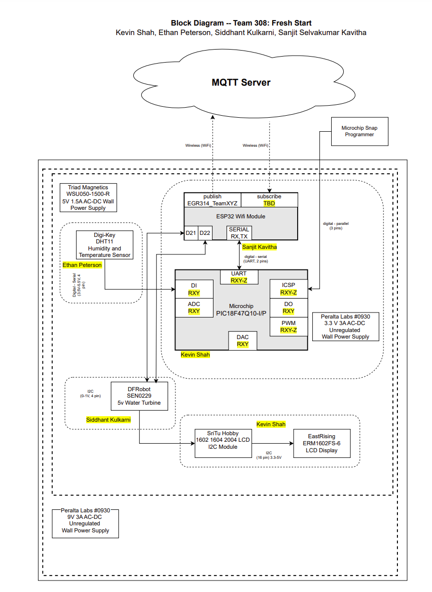

## Block Diagram 📊  

Below is the **block diagram**, providing an overview of the components used in our system and how they interact with teammates' designs. This diagram also highlights how multiple perspectives were considered in designing the **LCD module**.  

  

🔗 [**View Full Block Diagram**](https://drive.google.com/file/d/1y2u3dRcogwUWcMYUiIJfNdwun7hrlTpl/view?usp=sharing)  

If you have any feedback or suggestions, feel free to contribute! 🚀  
