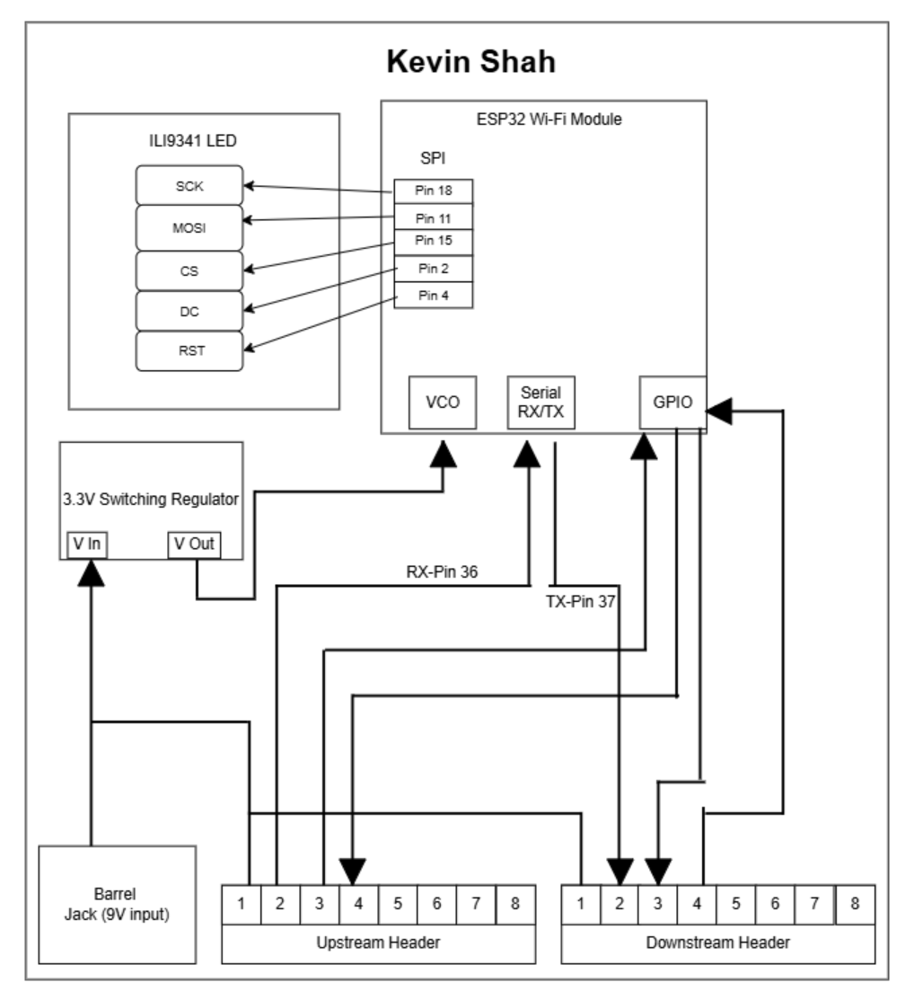

## Block Diagram 📊  

Below is the **block diagram**, providing an overview of the components used in our system and how they interact with teammates' designs. This diagram also highlights how multiple perspectives were considered in designing the **LCD module**.  

  

🔗 [**View Full Block Diagram**](https://drive.google.com/file/d/1RpGKMqPx2KDftNLyvjiD0EZUxZtFBrqE/view?usp=sharing)  

# Kevin Shah’s HMI Subsystem Block Diagram

## 1. Decision-Making Process

- **Centralizing Display & Cloud Connectivity**  
  **Why**: The HMI board is the user’s primary touchpoint—both on-site via the SPI LCD and remotely via MQTT—so combining the ESP32’s display-driving and Wi-Fi roles on one PCB minimizes inter-board dependencies.  
  **How**: We placed the ILI9341 (SPI LCD) and the ESP32 Wi-Fi module in the same block, wired over SPI for the screen and over the ESP32’s built-in UART and GPIO pins for network/control signals.

- **Power Integrity & Isolation**  
  **Why**: Display updates (especially during backlight changes) and Wi-Fi radio bursts draw significant current. Unstable voltage could corrupt data on the daisy-chain bus.  
  **How**: We included a dedicated 3.3 V switching regulator on our HMI board, fed from the 9 V barrel jack, with its own input decoupling caps. The clean 3.3 V rail powers both the ESP32 and the LCD module.

- **UART Daisy-Chain Integration**  
  **Why**: To pass sensor readings and motor commands through the HMI en route between the Sensor board and Motor board, while also listening for messages addressed to ‘K’.  
  **How**: We routed the bus’s RX (Pin 36) and TX (Pin 37) lines into the ESP32’s serial RX/TX pins. Our firmware examines the Source/Dest bytes and either forwards or processes each 64-byte frame.

- **GPIO-Driven User Controls**  
  **Why**: Physical buttons on the HMI allow manual “water flow override” or “data refresh” without needing the web interface.  
  **How**: We mapped key GPIO pins on the ESP32 to upstream header pins and onboard push-buttons (not shown here), so button presses generate outgoing “Set Water Flow” frames.

- **Modularity & Header Layout**  
  **Why**: Uniform headers across all four PCBs simplify wiring and reduce assembly errors at the showcase.  
  **How**: We replicated the 8-pin upstream/downstream header footprint used on other boards. Power, ground, UART, and two GPIO lines occupy the same pins at each stage.

---

## 2. Alignment with Product Requirements

| Requirement                                    | Block Diagram Feature                                     |
|------------------------------------------------|------------------------------------------------------------|
| **Real-time, local feedback**                  | SPI-driven ILI9341 LCD updates in <50 ms after a Type 4 frame. |
| **Remote monitoring & control**                | ESP32 Wi-Fi → MQTT link shown by Wi-Fi icon and cloud arrow.  |
| **Power stability under dynamic load**         | On-board 3.3 V switching regulator isolates display & radio. |
| **Seamless daisy-chain routing**               | RX/TX bus arrows into/out of the ESP32 block for frame forwarding. |
| **User-driven overrides**                      | GPIO arrow from ESP32 to header supports manual button commands. |
| **Ease of assembly & expansion**               | Standardized 8-pin headers match other subsystems, allowing mid-chain additions. |

- **Deterministic Latency**: By colocating the display driver and cloud transceiver, we eliminate extra hops—ensuring that once the ESP32 has sensor data, both local and remote updates occur in parallel, keeping total loop time under 500 ms.  
- **Educational Transparency**: The diagram’s clear segregation (power, bus, peripherals) helps K–12 students trace how electricity and data move through the system.  
- **Scalability**: Future enhancements (e.g., adding an additional status LED or a secondary sensor) can tap the same 3.3 V rail, UART bus, and GPIO header pins without redrawing the core block structure.  
- **Reliability**: The dedicated regulator and simple header wiring reduce points of failure, vital for a public exhibit environment.

