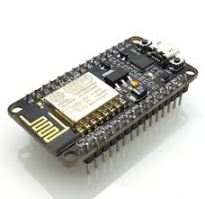
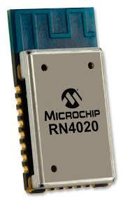
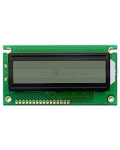

# EGR 314 - Component Selection Report  

## Name: Kevin Shah  
## Course: EGR 314  
## Assignment: Component Selection  

## 📄 [View Full Report](https://docs.google.com/document/d/16eBhtJ1a93Trgb88zd__rfECLNrKxZGtmtAWUIEOJiY/edit?usp=sharing)  
---

## Introduction  

This report includes multiple solutions for each major component of our design. I have considered and documented factors such as **cost, surface-mount compatibility, ease of integration, power efficiency, and performance**. Each selected component is justified based on the project requirements.  

---

## Major Component Selection  

### 🔹 2.1 Microcontroller Selection  

The **microcontroller** is the core of our system, responsible for **processing sensor data, managing communication, and executing tasks between modules**.  

#### **Microcontroller Options**  

| Microcontroller           | Description                                      | Image  | Pros                                            | Cons                                          | Cost  | Link   |
|---------------------------|--------------------------------------------------|--------|-------------------------------------------------|-----------------------------------------------|------|--------|
| **Microchip PIC18F47Q10**  | 8-bit MCU, UART interfaces, SMD Package         |  | Low power, UART support, modular design       | Less processing power (compared to 32-bit)   | $0.00 | [Link](#) |
| **ESP32-WROOM-32**         | 32-bit MCU with Wi-Fi/Bluetooth                 |  | High performance, wireless communication      | Higher power consumption                     | $0.00 | [Link](#) |
| **STM32F103C8T6**          | 32-bit ARM Cortex-M3                            |  | Most powerful, widely used in industry        | Complex to program, higher cost              | $6.08 | [Link](#) |

#### **Microcontroller Requirements & Pin Allocation**  

| Peripheral  | Requirement                                    |
|------------|----------------------------------------------|
| **UART**   | Minimum 3 (for inter-module communication) |
| **I2C**    | Required for LCD and sensor communication  |
| **ADC**    | Needed for water turbine sensor input     |
| **GPIO**   | Needed for additional controls & indicators |
| **PWM**    | Needed for LED indicators or actuators    |
| **Power**  | Stable 3.3V and 5V power supply           |

##### ✅ **Optimal Choice:**  
The **PIC18F47Q10** was chosen for **efficient power usage, UART support, and MPLAB X compatibility**. Additionally, its **SMD packaging** adheres to EGR 314 specifications.  

---

### 🔹 2.2 Wi-Fi Module Selection  

Since our system required **wireless communication**, I evaluated multiple Wi-Fi-enabled modules.  

#### **Wi-Fi Module Options**  

| Wi-Fi Module            | Description                             | Image  | Pros                                             | Cons                                   | Cost  | Link  |
|-------------------------|-----------------------------------------|--------|-------------------------------------------------|----------------------------------------|------|-------|
| **ESP32-WROOM-32**       | Integrated Wi-Fi & Bluetooth           |  | High performance, dual-core          | Requires custom PCB design            | $0.00 | [Link](#) |
| **ESP8266-12E-32**       | Lower-cost Wi-Fi module with UART       |  | Power-efficient, low cost            | Limited flexibility                    | $10.00 | [Link](#) |
| **RN4020 Bluetooth**     | Bluetooth module only                  |  | Low power consumption                 | No Wi-Fi, limited communication        | $11.61 | [Link](#) |

##### ✅ **Optimal Choice:**  
**ESP32-WROOM-32** was selected for **built-in Wi-Fi, cost efficiency, and system compatibility**.  

---

### 🔹 2.5 LCD Display Selection  

| LCD Display | Description                       | Image  | Pros                              | Cons                                | Cost  | Link  |
|------------|----------------------------------|--------|---------------------------------|---------------------------------|------|-------|
| **ERM1602FS-6** | 16x2 LCD with I2C interface  |  | Low cost, easy interface       | Requires I2C module              | $2.55 | [Link](#) |
| **HD44780**  | Standard 16x2 LCD               |  | Widely supported, cheap       | Requires more GPIO pins         | $3.00 | [Link](#) |
| **SSD1306 OLED** | High-contrast OLED display |  | Modern design, compact        | More expensive                   | $3.70 | [Link](#) |

##### ✅ **Optimal Choice:**  
**ERM1602FS-6** was selected for its **low power consumption and I2C compatibility**.  

---

## 🔹 ESP32 Table  

- **Model:** ESP32-DEVKITC-32UE  
- **Max Current:** 500 mA  

| Module   | Available | Needed | Associated Pins       |
|----------|-----------|--------|-----------------------|
| **UART**  | 3         | 1      | GPIO1, GPIO3          |
| **SPI**   | 3         | 1      | GPIO19, GPIO23, GPIO18, GPIO5 |
| **I2C**   | 2         | 1      | GPIO21, GPIO22        |

---

## 📌 Personal Responsibilities  

I am responsible for **managing the LCD module, ensuring integration with the microcontroller, setting up the SPI interface, and optimizing power usage**.  

Additionally, I work with other subsystems to ensure **data integration, signal integrity, and firmware compatibility**.  

---

## 📌 Conclusion  

This report provides the **rationale behind key component selections** based on **performance, cost, efficiency, and compatibility**.  

---

