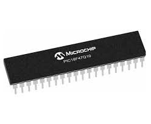
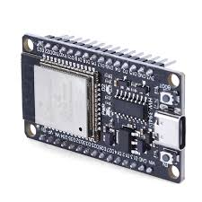
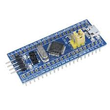
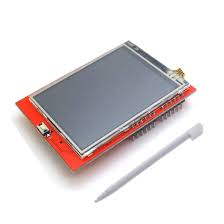
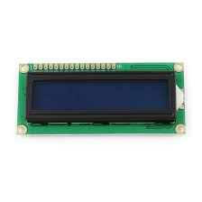
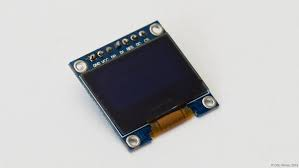
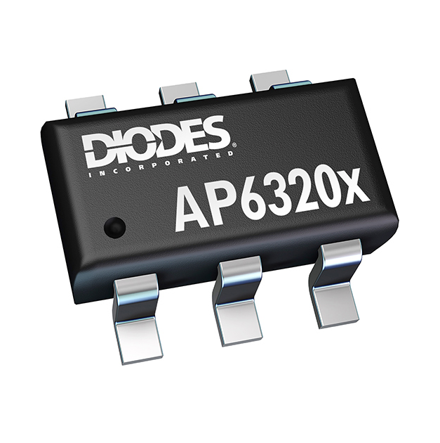
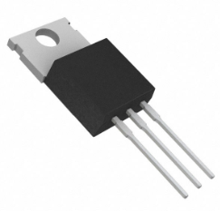
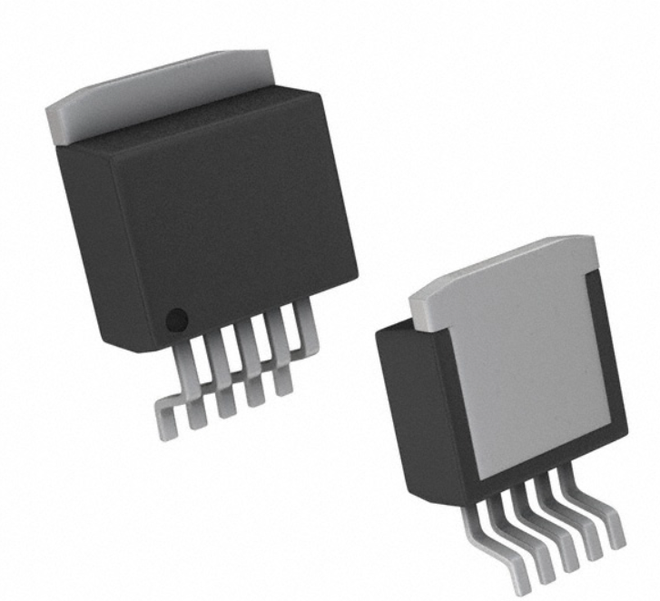

# EGR 314 - Component Selection Report  

## Name: Kevin Shah  
## Course: EGR 314  
## Assignment: Component Selection  

📄 **[View Full Report](https://docs.google.com/document/d/16eBhtJ1a93Trgb88zd__rfECLNrKxZGtmtAWUIEOJiY/edit?usp=sharing)**  

---

## Introduction  

This report presents multiple solutions for each major component of our design. Factors such as **cost, surface-mount compatibility, ease of integration, power efficiency, and performance** have been considered and documented. Each selected component is justified based on the project requirements.  

---

## Major Component Selection  

### 🔹 2.1 Microcontroller Selection  

The **microcontroller** is the core of our system, responsible for **processing sensor data, managing communication, and executing tasks between modules**.  

#### **Microcontroller Options**  

| Microcontroller           | Description                                      | Image  | Pros                                            | Cons                                          | Cost  | Link   |
|---------------------------|--------------------------------------------------|--------|-------------------------------------------------|-----------------------------------------------|------|--------|
| **Microchip PIC18F47Q10**  | 8-bit MCU, UART interfaces, SMD Package         |  | Low power, UART support, modular design       | Less processing power (compared to 32-bit)   | $0.00 | [Link](#) |
| **ESP32-WROOM-32**         | 32-bit MCU with Wi-Fi/Bluetooth                 |  | High performance, wireless communication      | Higher power consumption                     | $0.00 | [Link](#) |
| **STM32F103C8T6**          | 32-bit ARM Cortex-M3                            |  | Most powerful, widely used in industry        | Complex to program, higher cost              | $6.08 | [Link](#) |

##### ✅ **Optimal Choice:**  
The **ESP32** was chosen for its **efficient power usage, UART support, and MPLAB X compatibility**. Additionally, its **SMD packaging** adheres to EGR 314 specifications.  

---

### 🔹 2.2 LCD Display Selection  

#### **LCD Display Options**  

| LCD Display        | Description                                    | Image  | Pros                              | Cons                                | Cost  | Link  |
|--------------------|----------------------------------------------|--------|---------------------------------|---------------------------------|------|-------|
| **ILI9341**        | 2.4-inch TFT LCD with SPI interface          |  | High resolution (240x320), full-color, SPI interface | Higher power consumption compared to monochrome displays | $13.99 | [Link](https://www.amazon.com/DIANN-ILI9341-Display-320x240-Screen/dp/B0BNQD38T2) |
| **HD44780**  | Standard 16x2 LCD               |  | Widely supported, cheap       | Requires more GPIO pins         | $3.00 | [Link](#) |
| **SSD1306 OLED** | High-contrast OLED display |  | Modern design, compact        | More expensive                   | $3.70 | [Link](#) |

##### ✅ **Optimal Choice:**  
The **ILI9341** was selected for its **high resolution, color display, and SPI interface**, making it suitable for applications requiring detailed visual output.

---

## 🔹 2.3 ESP32 Table  

- **Model:** ESP32-DEVKITC-32UE  
- **Max Current:** 500 mA  

| Module   | Available | Needed | Associated Pins       |
|----------|-----------|--------|-----------------------|
| **UART**  | 3         | 1      | GPIO1, GPIO3          |
| **SPI**   | 3         | 1      | GPIO19, GPIO23, GPIO18, GPIO5 |
| **I2C**   | 2         | 1      | GPIO21, GPIO22        |

---
### 🔹 2.4 Voltage Regulator Selection  

#### **Voltage Regulator Options**  

| Voltage Regulator  | Description                          | Image  | Pros                              | Cons                                | Cost  | Link  |
|--------------------|----------------------------------|--------|---------------------------------|---------------------------------|------|-------|
| **AP63203WU-7** (Final Choice) | 3A synchronous buck converter |  | High efficiency, adjustable output voltage, low power dissipation | Produces heat at high loads | $1.38 | [Link](https://www.digikey.com/en/products/detail/diodes-incorporated/AP63203WU-7/9858426) |
| **LM7805 Linear Regulator**  | 5V fixed output linear regulator |  | Simple drop-in solution, stable 5V output | Higher power loss, requires heatsink at higher currents | $1.07 | [Link](https://www.digikey.com/en/products/detail/onsemi/MC7805CTG/919409) |
| **LM2575 Switching Regulator** | 5V step-down switching regulator |  | High efficiency, less heat dissipation | More complex circuit (requires inductor), higher cost | $2.84 | [Link](https://www.digikey.com/en/products/detail/texas-instruments/LM2575SX-5-0-NOPB/151989) |

##### ✅ **Optimal Choice:**  
The **AP63203WU-7** was selected for its **high efficiency, low power dissipation, and adjustable output voltage**, making it suitable for stable power supply requirements in our system.

---

## 📌 Personal Responsibilities  

I am responsible for **managing the LCD module, ensuring integration with the microcontroller, setting up the SPI interface, and optimizing power usage**.  

Additionally, I work with other subsystems to ensure **data integration, signal integrity, and firmware compatibility**.  

---

## 📌 Conclusion  

This report provides the **rationale behind key component selections** based on **performance, cost, efficiency, and compatibility**. The inclusion of the **ILI9341** LCD display enhances our system's capability to provide detailed and colorful visual feedback, aligning with the project's objectives.  

---

