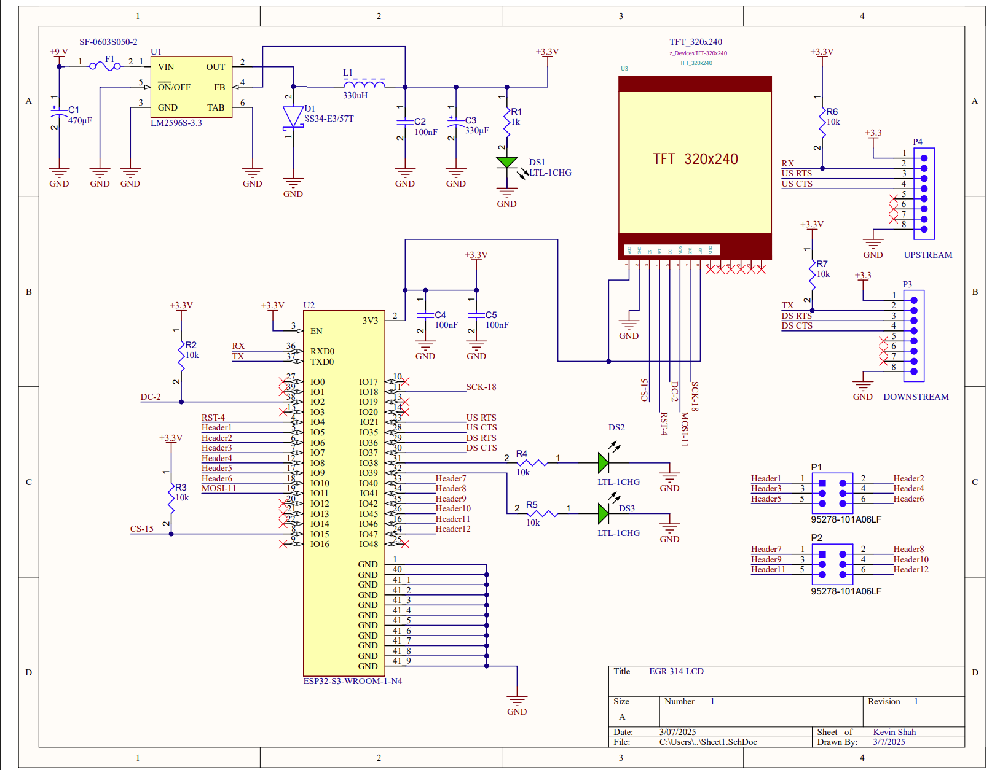
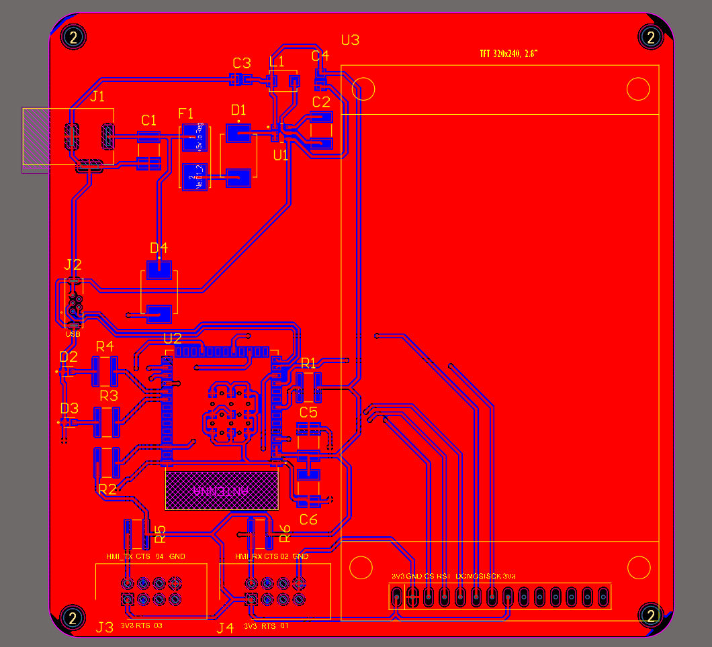
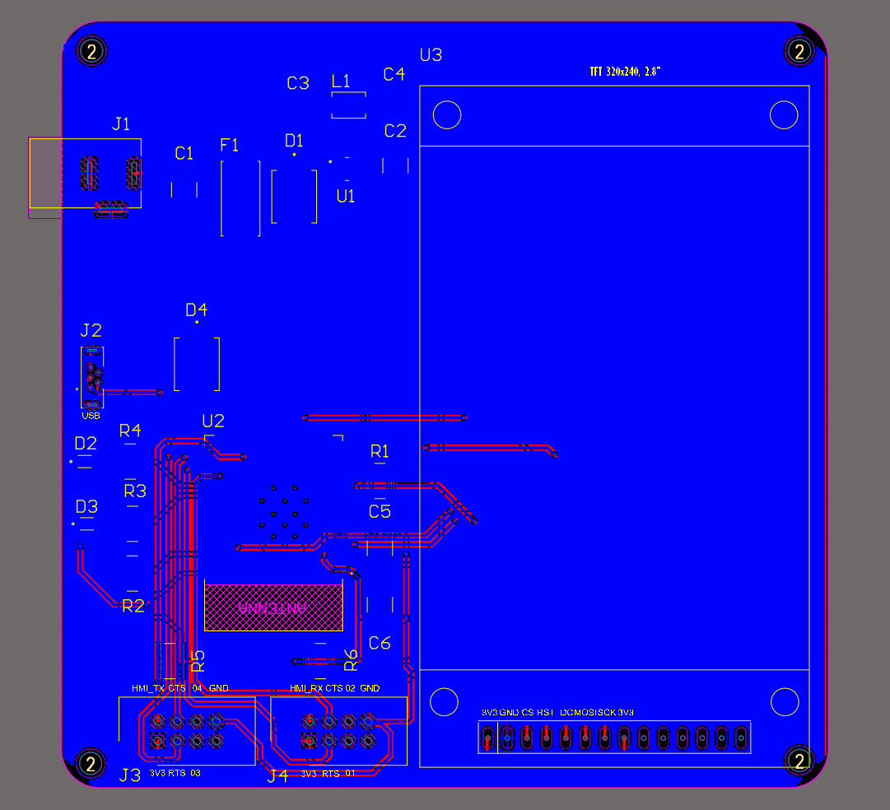
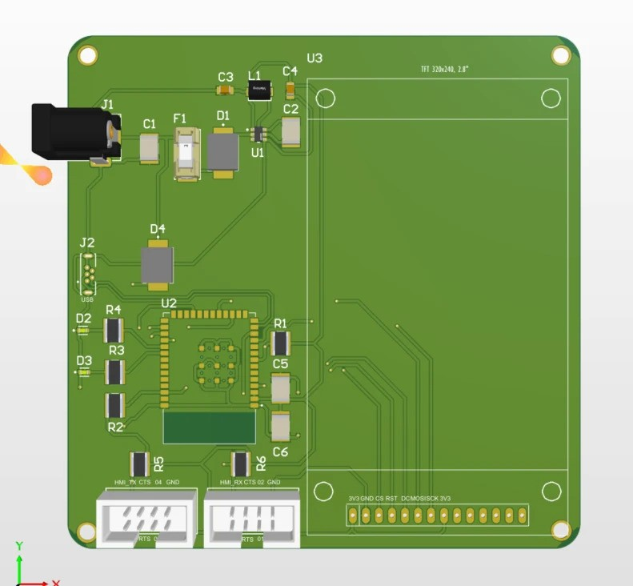

## Datasheets:
- **[ILI9341](https://cdn-shop.adafruit.com/datasheets/ILI9341.pdf)**
- **[609002115121](https://www.we-online.com/components/products/datasheet/609002115121.pdf)**
- **[02981001ZXT](https://www.littelfuse.com/assetdocs/littelfuse-fuse-holder-mega-298-bolt-down-datasheet.pdf?assetguid=5df9af12-7ee8-466f-8944-664a7902e1ce)**
- **[AP63200](https://www.diodes.com/assets/Datasheets/AP63200-AP63201-AP63203-AP63205.pdf)**

## Schematic and PCB

Below is the **Schematic and PCB**, providing an overview of the components used in our system. This diagram also highlights how multiple perspectives were considered in designing the **LCD module**.  

  
🔗 [**View the Schematic**](https://drive.google.com/file/d/1G5POpkL_Rq6nyJ6cgbkoUedZWS8gGMQq/view?usp=sharing)  

🔗 [**Schematic PDF**](https://drive.google.com/file/d/1PkatHU5QPrgG20pZr__rVINxxkNDHXXC/view?usp=sharing)  
🔗 [**PCB PDF**](https://drive.google.com/file/d/1mB5NOC1OxFwm2_9jSVI-WRnBECpQE7a5/view?usp=sharing)  

  
🔗 [**View PCB: Top Layer**](https://drive.google.com/file/d/1dhD5Cz_LtUWb9P19EDQvj1NKTsKChQoR/view?usp=sharing)  

  
🔗 [**View PCB: Bottom Layer**](https://drive.google.com/file/d/1zJoqoBrnG-8lp9ISNdeeMFX5T1Z7rIH1/view?usp=sharing) 

  
🔗 [**View 3D View of PCB**](https://drive.google.com/file/d/1WreppTGnbz-ksFBE5IJjrEa2b22zba7d/view?usp=sharing) 
